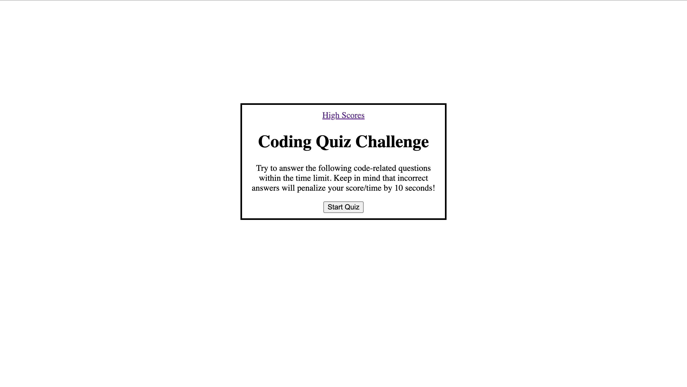

# JavaScript Code Quiz

## Description
---
This site tests your javascript knowledge with a timed quiz. starting with 50 seconds on the clock you will answer an array of questions with each incorrect answer subtracting 10 seconds from the timer. Using local storage we are able to see other users scores along with their initials so you can compare and attempt to beat other users high score. 

## Usage
---
On the home page of this quiz site users will see a brief description explaining rules to the quiz, to start the quiz just press the start button. New questions will appear when a question is answered until there are no longer any questions. After all questions are answered you will be presented with your final score, you can enter your initials to the high score board to see how you did against other users who have their score saved in the local storage. 

## Installation
---
To install this project to get the development environment running:

1. Clone GitHub repository here: https://github.com/aHoff6/Wep-API-Challenge
by clicking the green "code" button and copying the URL.

2. Open the Command Line and change the directory to where you would like to clone the directory.

3. Type the command "git clone" followed by the URL you copied earlier and press enter.

## Reference picture

## Deployed Link